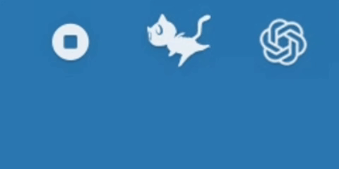

# MorganaPet

**基于女神异闻录5摩尔加纳形象的Mac桌面宠物，SwiftUI + AppKit。目前可以监控 Claude 和 Codex 的额度，以及电脑运行的基本情况。会根据CPU利用率为速度在状态栏奔跑。**

  

  

## 📑 目录

- [✨ 功能一览](#-功能一览)
- [🚀 安装](#-安装)
- [📦 关于源码](#-关于源码)
- [📜 版权说明](#-版权说明)

## ✨ 功能一览

### 状态栏

菜单栏里的摩尔加纳会一直跑，**跑多快取决于电脑CPU利用率**。设置里可以反转奔跑速度。

### 桌面宠物

| 操作 | 反应 |
|---|---|
| 🖱️ **点他一下** | 有几率随口说句话；连着快戳会不耐烦 |
| ✋ **摸头 / 摸肚子 / 摸脚 / 摸尾巴** | 反应各不相同 |
| 🐾 **戳他但他没话说** | 「喵呜」一声 |
| 🕐 **到整点** | 主动报时 |
| 🌙 **深夜还在敲代码** | 随机催你去睡 |
| 😴 **凌晨没人理他** | 00:00–06:00 十分钟无交互就打瞌睡 |
| 🖱️ **右键** | 查看 Codex 用量、Claude 额度、本机状态、打开设置 |

「查看本机状态」会报 CPU、内存、硬盘、电池和网络，5 秒刷新一次；电量低时他会催你插电。

## 🚀 安装

| 项目 | 要求 |
|---|---|
| 系统 | **macOS 26.0 或更高** |
| 架构 | Intel 与 Apple Silicon 均可（通用二进制） |
| 依赖 | 无。不用装 Xcode，不用装任何运行时 |

> ⚠️ 目前只在 **Apple Silicon + macOS 26.5** 上实机验证过。Intel 那半边和 26.0–26.4 编译产物齐全，但没有真机跑过。遇到问题欢迎开 issue。

1. 从 **[Releases](https://github.com/kekeeya/MorganaPet/releases)** 下载 `Mona-x.y.z.dmg`
2. 双击挂载，把 **Mona** 拖进 **应用程序**
3. 双击打开 —— **第一次会被拦下，见下**

### 第一次打开被拦下

你会看到「Apple 无法验证「Mona」是否包含可能危害 Mac 安全或泄漏隐私的恶意软件。」

**这是正常的。** 本项目没有 Apple 开发者证书，所有未签名的 macOS 应用第一次打开都是这个待遇。**别点「移到废纸篓」**，按下面走：

| 步骤 | 操作 |
|---|---|
| 1️⃣ | 点 **「完成」** 关掉弹窗 |
| 2️⃣ | 打开 **系统设置 → 隐私与安全性** |
| 3️⃣ | 往下滚到「安全性」，会看到「已阻止使用「Mona」…」，点 **「仍要打开」** |
| 4️⃣ | 再次确认，必要时用 Touch ID 或密码验证 |

之后正常双击即可，**只需放行这一次**。

> 🚫 **不要用 `xattr -dr com.apple.quarantine` 那条命令。** 从 macOS 14 起它需要终端先拿到「App 管理」权限，绕的圈子比走图形界面还大。

### 确认启动成功

Mona **没有程序坞图标**，别盯着程序坞看——**状态栏**出现一只跑动的猫、**桌面上**出现摩尔加纳，就是成功了。从状态栏图标可以显示、隐藏和退出。

## 📦 关于源码

> **⚠️ 这个仓库直接 clone 下来是构建不过的**
>
> 因为可能的版权问题，仓库里**不含任何美术资源**，`Assets.xcassets` 是空的，构建会在 `actool` 那步失败。
>
> **想用请直接下 [Releases](https://github.com/kekeeya/MorganaPet/releases) 里的 dmg。**

这里放的是代码框架和全部台词配置，供参考和学习。摩尔加纳说的每一句话都在 `Mona/Dialogue/` 下的 JSON 里，按触发场景分成 37 个文件。

## 📜 版权说明

源代码以 **[MIT License](LICENSE)** 发布。**美术资源不在此许可范围内**——摩尔加纳的形象权利归 Atlus / Sega 所有，本仓库不含也不授权任何美术资源。

本项目是**非商业粉丝作品**，与 Atlus、Sega 无任何关联，未获其授权或认可。摩尔加纳及《女神异闻录 5》（Persona 5）相关的一切权利归其各自权利方所有。本项目不收费、不接受捐赠、不含广告。

**若权利方认为本项目有任何不妥，请通过 issue 或邮件联系，我会立即下架相关内容。**

---

  ⭐ 觉得有意思的话，给个 star 吧 ⭐

